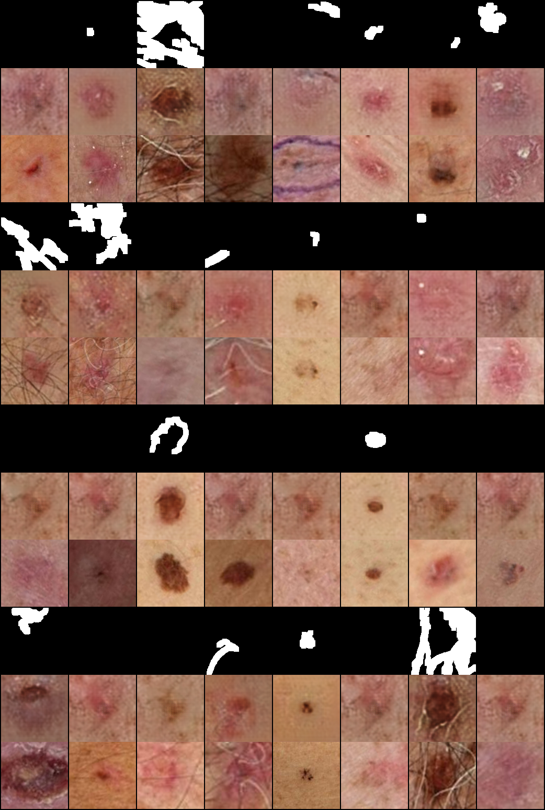
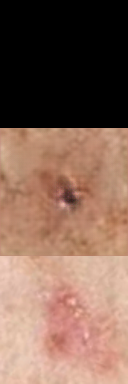
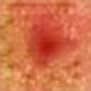

# Skin Lesion PixelGAN

A PyTorch implementation of PixelGAN/Pix2Pix with residual connections for generating synthetic skin lesion images to enhance cancer detection AI training datasets.

## Overview

This project implements an enhanced PixelGAN architecture (based on Pix2Pix) to generate realistic synthetic skin lesion images. It's designed to augment training data for machine learning models that detect and classify skin cancer, with a focus on addressing dataset imbalance problems.

### Core Features
- Generate high-quality synthetic skin lesion images with residual connections for improved detail
- Train on limited datasets and expand them through GAN-based synthesis
- Support for mixed precision training (AMP) for faster performance
- Optimized for 128×128 image resolution
- Batch processing with multi-worker data loading
- Comprehensive evaluation during training
- Leverages GPU acceleration (CUDA) for faster training and inference

## Project Structure

```
project_root/
│── .venv/                   # Virtual environment (Python dependencies)
│── data/                     # Data directory
│   │── input_images/        # Your original skin lesion images
│   │── test/                # Test dataset (auto-generated)
│       │── originals/       # Original test images
│       │── masks/           # Mask test images
│   │── train/               # Training dataset (auto-generated)
│       │── originals/       # Original training images
│       │── masks/           # Mask training images
│── pixelgan_models/         # Saved model checkpoints
│   │── [TIMESTAMP]/         # Model version with timestamp
│       │── generator_*.pth  # Generator model checkpoints
│       │── discriminator_*.pth # Discriminator model checkpoints
│── pixelgan_outputs/        # Generated images/output results
│   │── [TIMESTAMP]/         # Outputs for model version
│       │── samples/         # Training samples
│       │── test_*.png       # Test evaluations
│   │── generated_final/     # Final output images
│── .gitignore               # Git ignore file
│── dataset.py               # Dataset processing script
│── generate.py              # Image generation script (inference)
│── LICENSE                  # License file
│── models.py                # Defines the GAN model architecture
│── preprocess.py            # Preprocessing script for images
│── README.md                # Documentation
│── requirements.txt         # Dependencies
│── train.py                 # Training script
```

## Requirements

- Python 3.8+
- PyTorch 2.5.1+ (CUDA 12.1)
- opencv-python (for image processing)
- CUDA-enabled GPU (NVIDIA RTX recommended)
- torchvision
- Pillow
- numpy

You can install the required packages using:
```bash
pip install -r requirements.txt
```

### Leveraging GPU for Faster Training
To install the GPU-accelerated version of PyTorch with CUDA 12.1 support, use:

```bash
pip install torch torchvision torchaudio --index-url https://download.pytorch.org/whl/cu121
```

To ensure PyTorch is using your GPU, run:
```python
import torch
print(torch.cuda.is_available())  # Should return True
print(torch.cuda.get_device_name(0))  # Should show your GPU name
```

## Usage

### Data Preparation

1. Place your skin lesion images in the `data/input_images/` directory
2. Preprocess images to create training and test datasets:
```bash
python preprocess.py --source_dir ./data/input_images/ --data_dir data --test_split 0.1
```

### Training

Train the enhanced PixelGAN model with residual connections:
```bash
python train.py --data_dir data --batch_size 32 --amp --n_epochs 150 --img_size 128 --num_workers 8 --eval_freq 10 --save_freq 15
```

Training Parameters:
- `--batch_size`: Number of images processed in each batch (32 recommended for 128×128 images)
- `--amp`: Enable mixed precision training for faster performance
- `--n_epochs`: Total number of training epochs (150 recommended)
- `--img_size`: Image resolution (128×128 optimized)
- `--num_workers`: Number of data loading worker threads (8 recommended for multi-core CPUs)
- `--eval_freq`: How often to evaluate on test set (every 10 epochs)
- `--save_freq`: How often to save model checkpoints (every 15 epochs)

### Generating Synthetic Images

Generate synthetic images using a trained model:
```bash
python generate.py --model_folder pixelgan_models/[TIMESTAMP] --input_dir data/test --num_images 100 --output_dir pixelgan_outputs/generated_final --img_size 128 --num_workers 8
```

Generation Parameters:
- `--model_folder`: Folder containing the trained model (use the timestamp folder)
- `--input_dir`: Directory containing test images
- `--num_images`: Number of images to generate
- `--output_dir`: Directory to save generated images
- `--img_size`: Should match the size used during training (128)
- `--num_workers`: Number of worker threads for faster processing

Alternatively, you can generate using a specific model checkpoint:
```bash
python generate.py --model_path pixelgan_models/[TIMESTAMP]/generator_epoch_135.pth --input_dir data/test --num_images 100 --output_dir pixelgan_outputs/generated_epoch135 --img_size 128 --num_workers 8
```

## Model Architecture

The model uses an enhanced U-Net generator with residual connections:
- Residual blocks to improve gradient flow and training stability
- BatchNorm for regularization
- Optimized for 128×128 resolution
- 7 downsampling/upsampling levels

The discriminator is a PatchGAN that classifies 8×8 patches as real or fake, optimized for 128×128 input images.

## Results

Our model successfully generates realistic skin lesion images. Below are examples of our results:

### Training Progress Samples



*Figure 1: Grid showing multiple pairs of skin lesion images. Each pair shows the original image (top) and our model's generated output (bottom). Notice the variety of lesion types, colors, and textures that our model can reproduce.*

### Input-Output Comparison



*Figure 2: Detailed comparison showing a skin lesion. Top: input mask/original lesion, Bottom: generated synthetic lesion with preserved features but varied texture.*

### Final Generated Sample



*Figure 3: Example of a synthetic lesion from our final model. The model captures the characteristic reddish color, irregular border, and texture variations typical of skin lesions.*

In our generated outputs:
- Color tones are faithfully preserved from the input images
- Border irregularities and lesion shapes are maintained
- Fine details and texture patterns are realistically synthesized
- Various lesion types (melanocytic, vascular, etc.) are represented

Evaluation metrics showed consistent improvement over training epochs, with pixel-wise L1 loss decreasing from ~0.21 to ~0.16 over 150 epochs, indicating the model's growing ability to produce high-fidelity images.

## Academic Context

This project was developed as part of a coursework assignment for [COMP425](https://www.concordia.ca/academics/undergraduate/calendar/current/section-71-gina-cody-school-of-engineering-and-computer-science/section-71-70-department-of-computer-science-and-software-engineering/section-71-70-10-computer-science-and-software-engineering-courses.html) at [Concordia University](https://www.concordia.ca/). The goal was to implement a GAN architecture to generate synthetic medical images and evaluate its effectiveness in improving downstream AI model performance.

## Contributors

- [Abdessalam Ait Haqi](https://github.com/AbdessalamAithaqi)
- [Alexander Chneerov](https://github.com/achneerov) (provided the augmented pictures I started with)

## License

This project is licensed under the MIT License - see the [LICENSE file](LICENSE) for details.

## Acknowledgments

- The original Pix2Pix paper: [Image-to-Image Translation with Conditional Adversarial Networks](https://arxiv.org/abs/1611.07004)
- The residual network concept from: [Deep Residual Learning for Image Recognition](https://arxiv.org/abs/1512.03385)
- [PyTorch](https://pytorch.org/) team for the deep learning framework